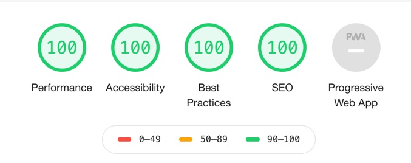

# Hugo framework

I build this demo website with Hugo. Hugo is a framework to build a static website using Markdown and/or HTML-files. In order for this to work I had to install Hugo on my Mac and then find a template to layout the content. With this you can build your site locally and then commit to Github. I then connected Github with Netlify which builds and publishes the site to the web.

This all work blazingly fast, is stable and delivers really clean and optimised code.

